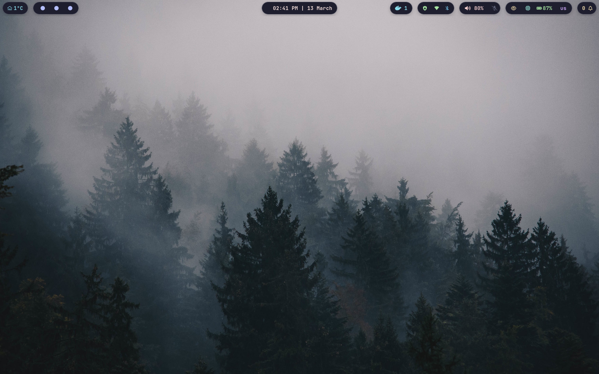
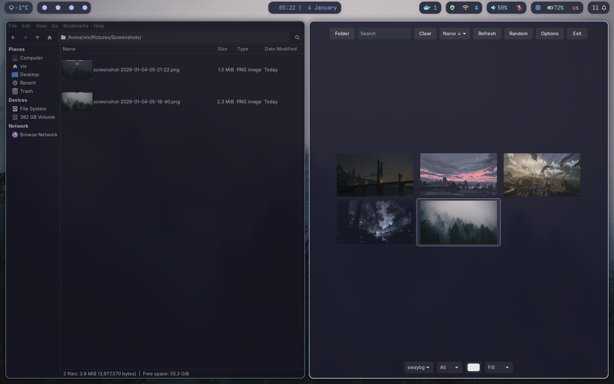
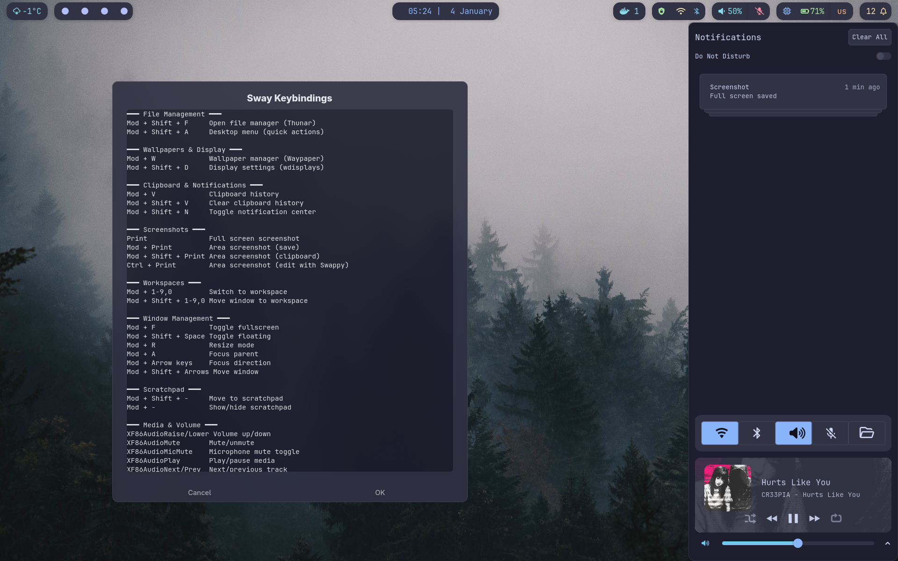
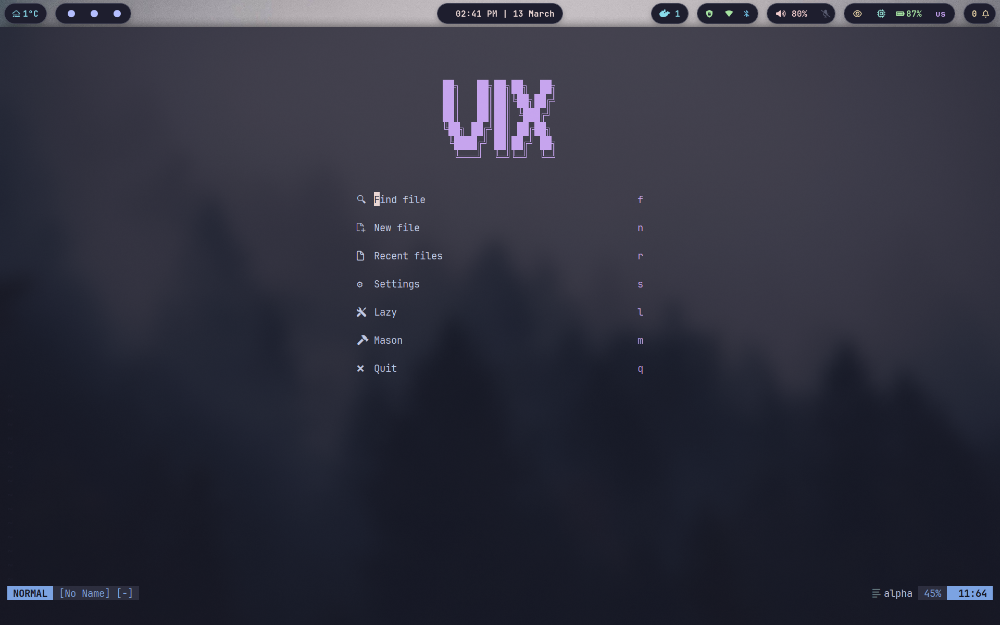

# Dotfiles

Personal configuration files for Arch Linux with Sway (Wayland) desktop environment.

## Overview

### 1. Sway Desktop



### 2. File Manager and Wallpaper



### 3. Terminal and Notification Center



### 4. Neovim



## Quick Start

### Management Tool

The `workstation` command provides unified management for dotfiles and systemd services:

```bash
# Bootstrap new system
workstation setup                   # Full system provisioning with Ansible

# Update from git
workstation update                  # Pull changes and reapply configuration
workstation update -n               # Dry-run to preview changes

# Dotfiles management
workstation dotfiles link           # Apply all symlinks
workstation dotfiles status         # Check symlink status
workstation dotfiles doctor         # Validate environment

# Systemd services
workstation services list           # List available services
workstation services enable-all     # Enable all services/timers
workstation services disable-all    # Disable all services/timers
workstation services status         # Show status of all services
```

After running `workstation dotfiles link`, the script is available globally from any directory.

## Installed Components

### Desktop Environment

- **SwayFX** - Wayland compositor with blur, shadows, rounded corners
- **Waybar** - Status bar with custom scripts
- **Greetd + ReGreet** - Display manager (login screen)
- **Plymouth** - Boot splash screen
- **GTKLock** - Screen locker
- **Swayidle** - Idle management and auto-lock
- **Wlogout** - Logout/power menu
- **Swaybg** - Wallpaper setter

### Notifications & OSD

- **SwayNC** - Notification daemon with DND
- **SwayOSD** - Volume/brightness overlay
- **Batsignal** - Battery notifications
- **libnotify** - Notification library

### Launchers & Tools

- **Wofi** - Application launcher
- **Search Menu** - Fast file & directory search - `$mod+Shift+s`
- **Keybindings Help** - Visual reference for shortcuts - `$mod+Shift+h`
- **Cliphist** - Clipboard manager
- **Wdisplays** - Display configuration GUI
- **Waypaper** - Wallpaper selector

### Screenshots & Media

- **Grim** - Screenshot capture
- **Slurp** - Region selector
- **Swappy** - Screenshot editor
- **Feh** - Image viewer
- **VLC** - Media player
- **FFmpeg** - Media processing

### Terminal & Shell

- **Alacritty** - GPU terminal emulator
- **Fish** - Shell with syntax highlighting
- **Tmux** - Terminal multiplexer
- **Fisher** - Fish plugin manager
- **Tide** - Fish prompt theme

### CLI Tools

- **Bat** - Syntax-highlighted cat
- **Eza** - Modern ls replacement
- **Ripgrep** - Fast grep
- **Fd** - Fast find
- **Chafa** - Terminal image viewer
- **Trash-cli** - Trash management
- **Reflector** - Mirror list updater
- **GitHub CLI** - GitHub integration

### Development

- **Neovim** - Text editor with LSP
- **Visual Studio Code** - IDE
- **Git** - Version control
- **PHP** + Composer (PHPStan, Rector, PHP-CS-Fixer, Pint, PHPCS)
- **Python** + pipx (Black, Flake8, Mypy, Pre-commit)
- **Go** - Go language runtime
- **Docker** + Docker Compose
- **Base-devel** - Build tools (GCC, Make, etc.)

### Applications

- **Firefox** - Web browser
- **Discord** - Chat (with BetterDiscord)
- **Telegram Desktop** - Messenger
- **Spotify** - Music streaming
- **Obsidian** - Note-taking
- **Zathura** - PDF viewer
- **Thunar** - File manager

### System Services

- **PipeWire** + WirePlumber - Audio system
- **PulseAudio** (via pipewire-pulse) - Audio compatibility
- **Pavucontrol** - Audio mixer
- **Better Control** - Audio device switcher
- **Bluetooth** (bluez + blueman) - Bluetooth stack
- **NetworkManager** - Network management
- **UFW** - Firewall
- **Udiskie** - Automount removable drives
- **Auto-cpufreq** - CPU governor optimization
- **WireGuard** - VPN

### Hardware Support

- **Brightnessctl** - Backlight control
- **CPU Microcode** - AMD/Intel updates
- **GPU Drivers** - NVIDIA/AMD/Intel support
- **Xorg-xwayland** - X11 app compatibility

### Desktop Integration

- **XDG Desktop Portal** - Desktop integration
- **xdg-desktop-portal-wlr** - Wayland portal
- **GTK** - GTK theming (Catppuccin)
- **Cursor Theme** - Catppuccin cursors

### Package Management

- **Yay** - AUR helper
- **Flatpak** - Universal packages

### Fonts

- **JetBrains Mono Nerd Font** - Primary monospace font
- **Font Awesome** - Icon fonts (TTF, OTF, WOFF2)

### Theming

- **Catppuccin Mocha** - Consistent color scheme across:
  - GTK (2.0, 3.0, 4.0)
  - Sway/SwayFX
  - Terminal (Alacritty, Bat)
  - Waybar, SwayNC, SwayOSD
  - Zathura, Wofi, Wlogout
  - Plymouth boot screen
  - Greetd/ReGreet
  - Cursor theme

## Configuration Structure

- `config/` - Application configurations
- `bin/` - Executable scripts
- `ansible/` - Ansible playbooks for system provisioning
- `systemd/user/` - User systemd services and timers
- `tools/` - Development tool configurations (PHP, Python, JS, etc.)
- `themes/` - Plymouth and GRUB themes
- `wallpapers/` - Wallpaper collection
- `dotfiles.json` - Symlink mapping configuration

## Customization

### Adding New Dotfiles

1. Place your config file in the appropriate directory under `config/`
2. Add a mapping entry to [dotfiles.json](dotfiles.json)
3. Run `workstation dotfiles link` to create the symlink

## License

This project is licensed under the MIT License - see the [LICENSE](LICENSE) file for details.

## Acknowledgments

- [Catppuccin](https://github.com/catppuccin/catppuccin) - Color scheme
- [Sway](https://swaywm.org/) - Wayland compositor
- All the amazing open-source projects that make this configuration possible

## Related Resources

- [Arch Linux Wiki](https://wiki.archlinux.org/)
- [Sway Documentation](https://github.com/swaywm/sway/wiki)
- [Waybar Examples](https://github.com/Alexays/Waybar/wiki/Examples)
- [r/unixporn](https://reddit.com/r/unixporn) - Desktop customization showcase
